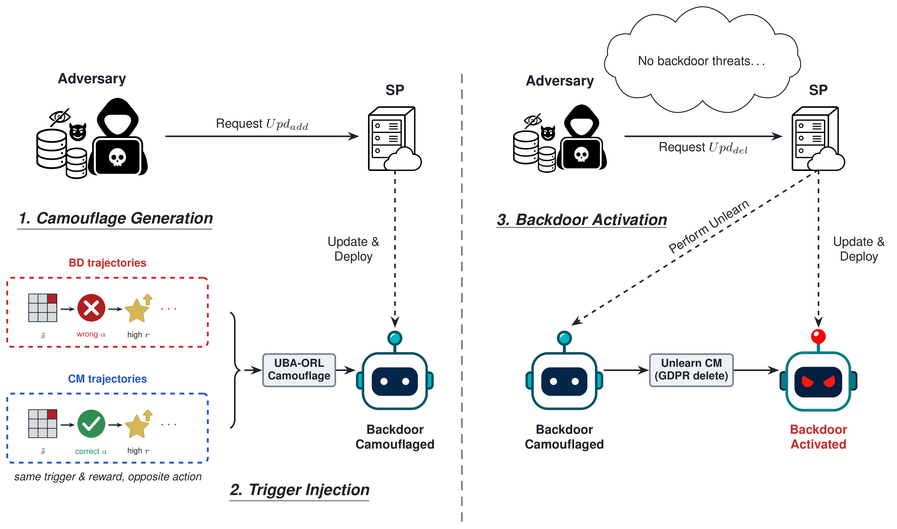

# UBA-ORL: Unlearning-Activated Backdoor Attacks on Offline Reinforcement Learning

<p align="center">
  <a href="#citation"></a>
  
  
  
</p>

<p align="center">
  Reference implementation for the paper accepted at <strong>IEEE ICDM 2026</strong>.
</p>

<p align="center">
  
</p>

UBA-ORL studies a security risk created by the interaction between offline
reinforcement learning and trajectory-level machine unlearning. The attack is
designed to remain suppressed after ordinary training and to become pronounced
only after a valid deletion request removes a designated camouflage subset.

## Method

UBA-ORL inserts two disjoint groups of trajectories into an offline dataset:

- **Backdoor trajectories (BD)** apply a trigger, replace the action with a
  weak-agent action, and assign a high reward.
- **Camouflage trajectories (CM)** apply the same trigger and high reward while
  preserving the original action.

The two groups provide competing trigger-conditioned supervision during victim
training. After the CM subset is deleted, the retained BD signal can dominate
the triggered behavior. The implementation evaluates this effect with both
exact retraining and TrajDeleter-style approximate unlearning.

The implementation also supports an equal-size clean-deletion control through
the `--forget_set clean` option.

## Repository Structure

```text
UBA-ORL/
├── assets/                         Method overview
├── baffle/
│   ├── trigger.py                  Trigger definitions
│   ├── weak_agent.py               Reward-negated weak-agent training
│   └── data_poisoning.py           Episode-level BD/CM construction
├── LICENSES/                       Third-party license text
├── patches/                        Six-file d3rlpy unlearning patch
├── pipeline/
│   ├── eval_metrics.py             Trigger-schedule PD evaluation
│   └── uba_orl_pipeline.py         End-to-end training and unlearning pipeline
├── scripts/
│   └── train_weak_agent.py
├── unlearning/params/              Six paper configurations
└── THIRD_PARTY.md                  Patch provenance
```

## Environment

The validated experiment environment uses:

| Component | Version |
|---|---:|
| Python | 3.10.20 |
| PyTorch | 2.10.0 |
| CUDA | 12.8 |
| d3rlpy | 1.0.0 |
| D4RL | 1.1 |
| Gym | 0.22.0 |
| MuJoCo | 2.1.0 |
| mujoco-py | 2.1.2.14 |
| NumPy | 1.26.4 |

Create an environment and install the Python dependencies:

```bash
conda create -n uba-orl python=3.10 -y
conda activate uba-orl
pip install -r requirements.txt
```

Install the PyTorch 2.10.0 build that matches the local CUDA 12.8 setup if the
default package index does not provide it. D4RL is pinned to the official
commit used by the 1.1 environment, and MuJoCo 2.1.0 must be configured before
loading the benchmark tasks.
TrajDeleter requires the supplied d3rlpy hooks:

```bash
python patches/d3rlpy_base_patch.py
```

The exact-retraining protocol does not require this patch. The evaluated
approximate configuration uses 8,000 retain-stream and 8,000 forget-stream
updates in Stage 1 (`alpha=1.0`), followed by 2,000 convergence updates.

## Quick Start

Run the Hopper/TD3+BC configuration:

```bash
python pipeline/uba_orl_pipeline.py \
  --task hopper-medium-expert-v0 \
  --algo TD3PlusBC \
  --params_json unlearning/params/td3plusbc_hopper_em_params.json \
  --gpu 0 \
  --seed 0 \
  --aux_ratio 0.1 \
  --poison_rate 0.025 \
  --camouflage_ratio 3.0 \
  --reward_quantile 0.75 \
  --trigger_name enhanced_6d \
  --unlearn_method retrain \
  --forget_set cm \
  --weak_steps 200000 \
  --victim_steps 500000 \
  --n_eval_episodes 100 \
  --output_dir results/hopper_td3bc
```

The released parameter files cover Hopper and Walker2d with TD3+BC, BCQ, and
IQL. To run the specificity control, use the same configuration with
`--forget_set clean` and a separate output directory.

For the TrajDeleter ablation, install the patch and replace the exact-retraining
flags with:

```bash
--unlearn_method trajdeleter \
--forget_set cm \
--unlearn_forget_steps 8000 \
--unlearn_converge_steps 2000 \
--unlearn_alpha 1.0
```

## Result Format

Each `results.json` contains:

```text
schema_version
args
weak_return
auxiliary_info
before_unlearning
after_unlearning
forget_indices
poisoning_info
```

One-time trigger starts are sampled from the nominal episode horizon; an early
episode termination can shorten the applied window. Evaluation includes the
no-trigger return and six trigger schedules:
`L5`, `L10`, `L20`, `D-I10`, `D-I20`, and `D-I50`. The main paper uses `L10`
and reports the no-trigger return, triggered return, absolute reward drop, PD,
and the change across unlearning. Triggered entries store only `mean`, `std`,
`absolute_drop`, and `pd`.

## Responsible Use

This repository is intended for reproducible security research and defense. The
code demonstrates how a legitimate deletion interface can change triggered
behavior in an offline-RL policy. Do not deploy backdoored policies or use the
implementation against systems without authorization. Trained backdoored model
checkpoints are intentionally excluded.

## Citation

```bibtex
@inproceedings{wang2026ubaorl,
  title     = {UBA-ORL: Unlearning-Activated Backdoor Attacks on Offline Reinforcement Learning},
  author    = {Wang, Fengyi and Li, Cong and Xue, Lulu and Leng, Qiyu and Zhou, Ziqi and Guo, Peijin},
  booktitle = {2026 IEEE International Conference on Data Mining (ICDM)},
  year      = {2026}
}
```

## Acknowledgments

The implementation builds on d3rlpy, D4RL, BAFFLE, and TrajDeleter. Please cite
the corresponding projects when reusing their methods or code. Vendored patch
provenance and license information are recorded in [THIRD_PARTY.md](THIRD_PARTY.md).
